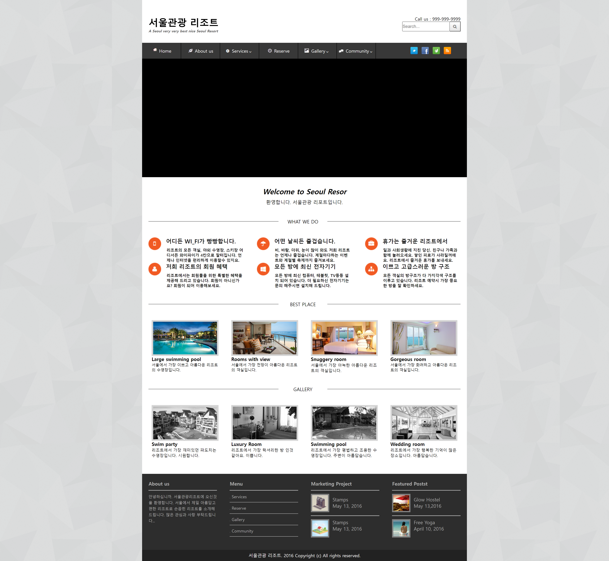
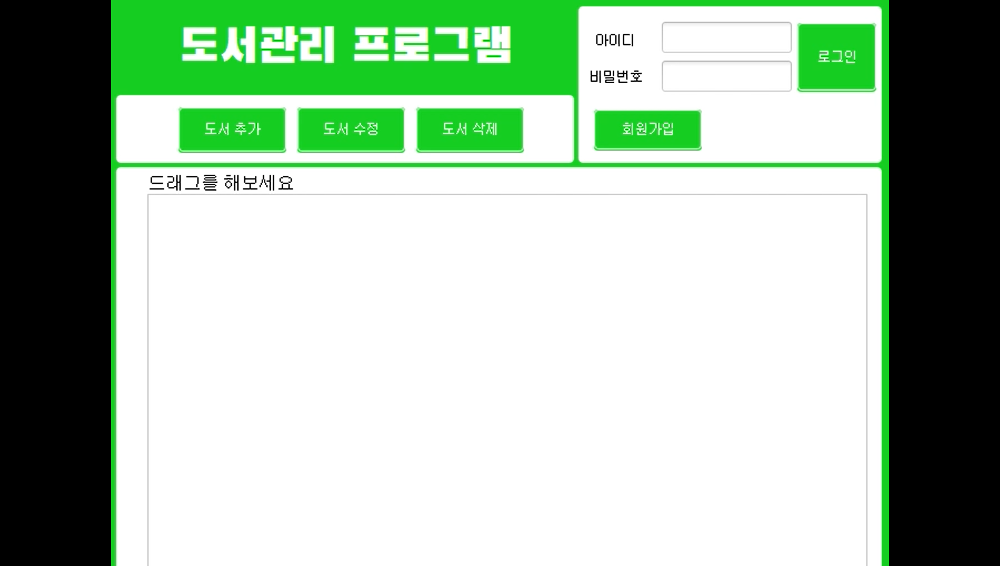

 
 
 
<h1 align="center">Hi 👋, seokin Portfolio(포트폴리오)</h1>
<h3 align="center">열정적인 프론트엔드 개발자 정석인</h3>
 
 
 

<h1 align="left"> ⚡ 저의 스킬 ⚡ </h1>

 - 프론트엔드 기술 : HTML5, CSS3, Javascript(ES6), jQuery

 - 백엔드 기술 : JSP. PHP

 - 데이터베이스 기술 : MYSQL

 
<h1 align="right"> 🥇 수상 경력 🥇 </h1>
<h3 align="right">2016 지방기능경기대회</h3>

 - 수여 기관 : 광주광역시 기능경기위원회

 - 내용 : 2016 지방기능경기대회 웹디자인 및 개발 직종 우수상

 
 
 
<h1 align="left"> 👨‍💻 디자인 및 자기개발 포트폴리오 👨‍💻 </h1>
<h2 align="left"># 디자인</h2>
<h3 align="left"> - 배너 제작 디자인</h3>

배너 제작 - 나이키

 

배너 제작 - 버거킹

 
 
<h3 align="left"> - 투톤 디자인</h3>

PANTONE X 나이키 컨셉 투톤 디자인

 
 
<h3 align="left"> - 여행사 페이지 디자인</h3>

여행사 페이지

 
 
<h3 align="left"> - 카페 페이지 디자인</h3>

담양 즐겨가는 카페 슬라이드 디자인

 

담양 즐겨가는 카페 와이어프레임 디자인

 
 
<h3 align="left"> - 일러스트 배너제작 디자인</h3>

타랑께

 

플로은행

 
 
<h3 align="left"> - 무선블루투스 이어폰 디자인</h3>

상품 상세설명 에어맥스 디자인

 
 
<h3 align="left"> - 낚시대회 (유튜브, 인스타) 홍보용 포스터 디자인</h3>

낚시대회 (유튜브, 인스타) 홍보용 포스터

실제 <b>"강화발이</b> 유튜버 커뮤니티 부분 대회 공지용으로 사용, 팬심으로 간단하게 포토샵으로 구현해봤습니다.</h2>

 
 
 
<h2 align="left"># 고등학교 지방대회, 전국대회 문제 및 자기개발</h2>
<h3 align="left"> - 지방대회 서울지역 문제풀이</h3>

포토샵, 일러스트 디자인 / HTML5,CSS3 퍼블리싱 / Javascript, jQuery 기능 구현 / mysql, php 백엔드, DB 영역 (구현하였습니다.)

 
 
<h3 align="left"> - 전국대회 전남지역 문제풀이</h3>

포토샵, 일러스트 디자인 / HTML5,CSS3 퍼블리싱 / Javascript, jQuery 기능 구현 / mysql, php 백엔드, DB 영역 (구현하였습니다.)

 
 
<h3 align="left"> - 전국대회 경기지역 문제풀이</h3>

포토샵, 일러스트 디자인 / HTML5,CSS3 퍼블리싱 / Javascript, jQuery 기능 구현 / mysql, php 백엔드, DB 영역 (구현하였습니다.)

 
 
<h3 align="left"> - 전국대회 서울지역 문제풀이</h3>

포토샵, 일러스트 디자인 / HTML5,CSS3 퍼블리싱 / Javascript, jQuery 기능 구현 / mysql, php 백엔드, DB 영역 (구현하였습니다.)

 
 
<h3 align="left">대학 기말 조별과제(2인) 뮤직플레이어</h3>

JSP, mysql 사용하여 사용자별 음원 구현과 Javascript, jQuery를 사용해 반복재생, 랜덤재생, 음악 멈춤, 전체 재생, 뮤직 리스트 등을 구현하였습니다.

 
 
<h3 align="left">대학 기말평가(2인) 도서관리자프로그램</h3>

다이어그램, java, css, mysql등 백엔드, DB 영역, JAVA Eclipse프로그램을 이용해서 로그인, 회원가입, 회원삭제, 회원수정, 아이디수정, 도서등록, 도서수정, 도서삭제 등을 구현하였습니다. 

videos파일에 구현 영상 첨부했습니다

 
 
<h3 align="left"> - 카페24 상세페이지 구현</h3>

개인적으로 새로운 디자인 트렌드에 맞춰서 레이아웃 등 기술동향을 주시하고자 자기개발 삼아서 해봤습니다 - 포토샵으로 다시 만들어보면서 디자인 폰트, 사이즈 및 구조 파악  / HTML5,CSS3 퍼블리싱 / Javascript, jQuery 기능 (구현하였습니다.)

videos파일에 구현 영상 첨부했습니다

 
 
 
